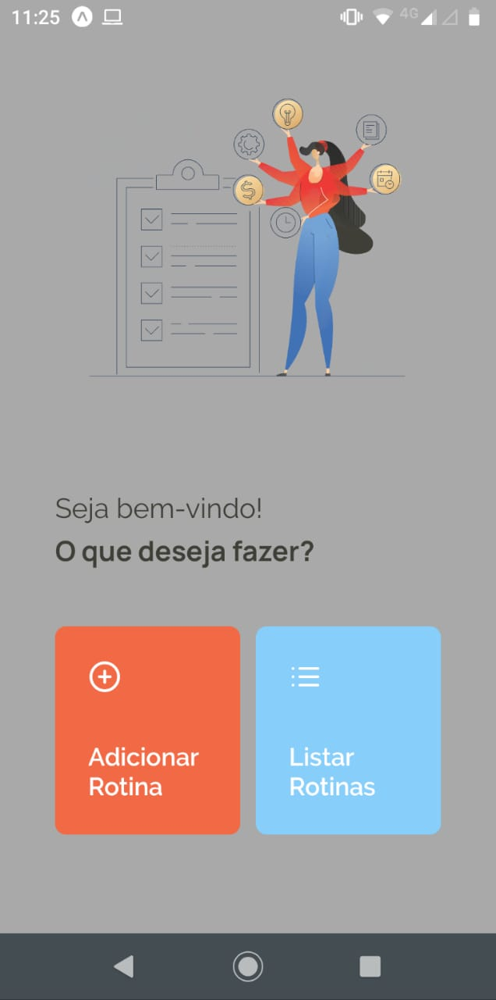
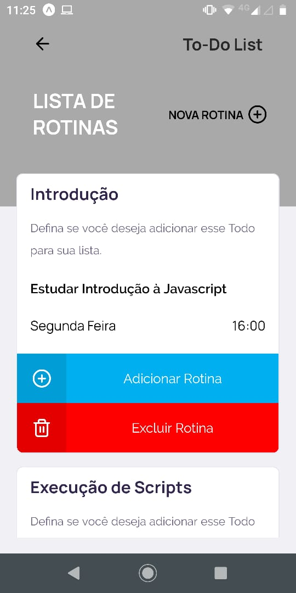
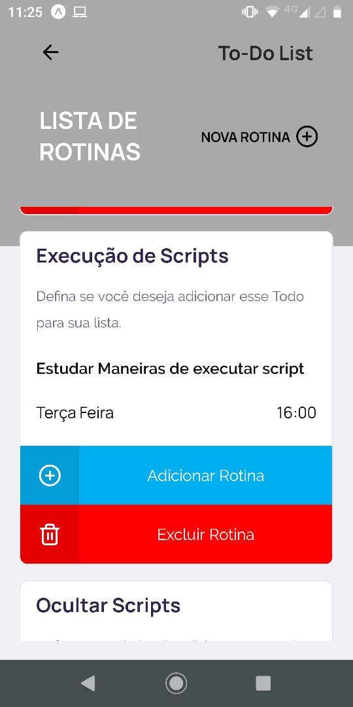
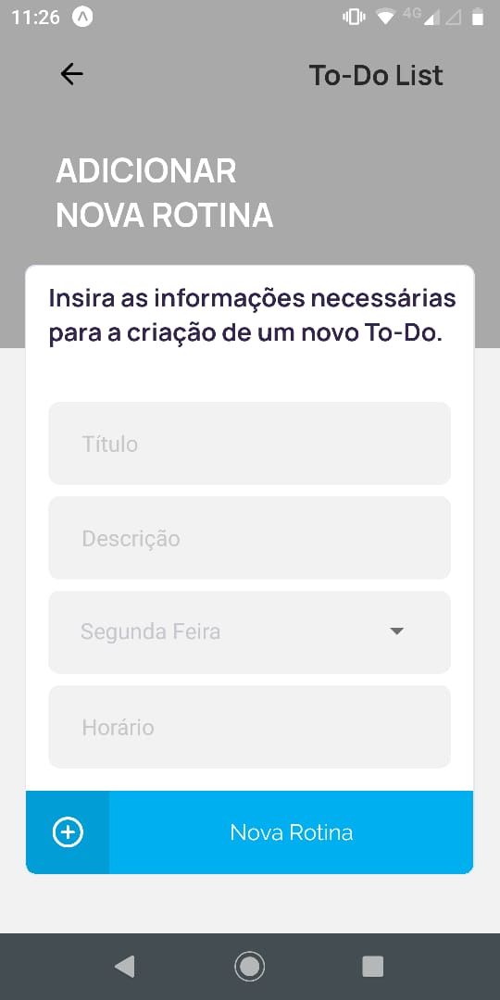
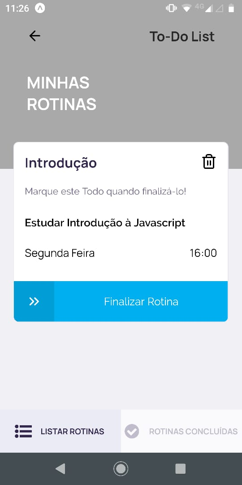
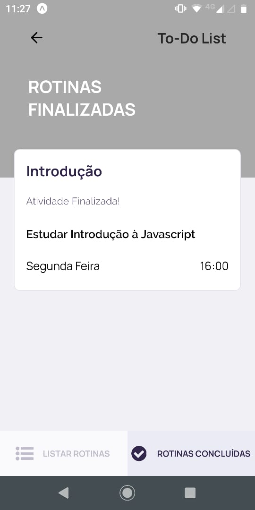

# ToDo List

 

<h2 align="center"> Desenvolvida com as tecnologias  JavaScript, 
     Node,  React Native e 
     SQLite.
</h2>

<h3> Outras tecnologias: </h3>
<ul>
  <li> <a href="https://expressjs.com/pt-br/"> Express </a> </li>
  <li> <a href="https://www.npmjs.com/package/axios"> Axios </a> </li>
  <li> <a href="https://www.npmjs.com/package/cors"> Cors </a> </li>
  <li> <a href="http://knexjs.org/"> Knex </a> </li>
  <li> <a href="https://expo.io/"> Expo </a> </li>  
</ul>

<h4 align="justify">Para esse processo seletivo foi desenvolvido uma API em NodeJS e hospedada a aplicação na plataforma heroku a partir do link a seguir: https://listapplicationto-do.herokuapp.com/todo
é possível encontrar o código dessa api a partir desse <a href="https://github.com/PauloHenriqueSousa2020/TodoList/tree/main/backend">Link</a> para obter mais informações a cerca do backend desenvolvido </h4>

<h3> Para utilizar: </h3>

 Faça o download do projeto no GitHub  
 Execute <code>npm install</code> ou <code>yarn install</code> na pasta <b>mobile</b>, para instalar as dependências da aplicação. 
 Execute <code>npm start</code> ou <code>yarn start</code> na pasta <b>mobile</b>, acesse localhost:19002, leia o QR Code no seu 
celular utilizando o aplicativo Expo <a href="https://play.google.com/store/apps/details?id=host.exp.exponent&hl=pt_BR"> (Download na Playstore) </a> -
<a href="https://apps.apple.com/br/app/expo-client/id982107779"> (Download na App Store) </a>. É possível também usar algum emulador de Android ou iOS. 

<h3>Click na imagem abaixo e seja redirecionado para o vídeo da aplicação criada com React Native em um link do Youtube.</h3>

<h2 align="center"> Layout da aplicação </h2>

<h3> Interface MOBILE: </h3>

<table>
	<tr>
		<th width="33.3%">
			Landing 
		</th>
		<th width="33.3%">
			Lista de casos
		</th>
    <th width="33.3%">
			Lista de Casos
		</th>
	</tr>
	<tr><!-- Prevent zebra stripes --></tr>
	<tr>
		<td>
			
		</td>
		<td>
			
		</td>
    <td>
			
		</td>
	</tr>
</table>

<table>
	<tr>
		<th width="33.3%">
			Adicionar nova rotina 
		</th>
		<th width="33.3%">
			Lista de Rotinas a Concluir 
		</th>
    <th width="33.3%">
		  Lista de Rotinas Concluidas
		</th>
	</tr>
	<tr><!-- Prevent zebra stripes --></tr>
	<tr>
		<td>
			
		</td>
		<td>
			
		</td>
    <td>
			
		</td>
	</tr>
</table>

<h3> Funcionalidades desenvolvidas: </h3>

<ul>
	<li>Listagem de Rotinas já criadas</li>
	<li>Criação de uma nova Rotina</li>
	<li>Exclusão de Rotina</li>
	<li>Adicionar uma Rotina como tarefa a ser concluida</li>
	<li>Excluir uma Rotina de tarefa a ser concluida</li>
	<li>Listagem de Rotinas a serem concluidas</li>
	<li>Listagem de Rotinas ja concluidas</li>
</ul>

